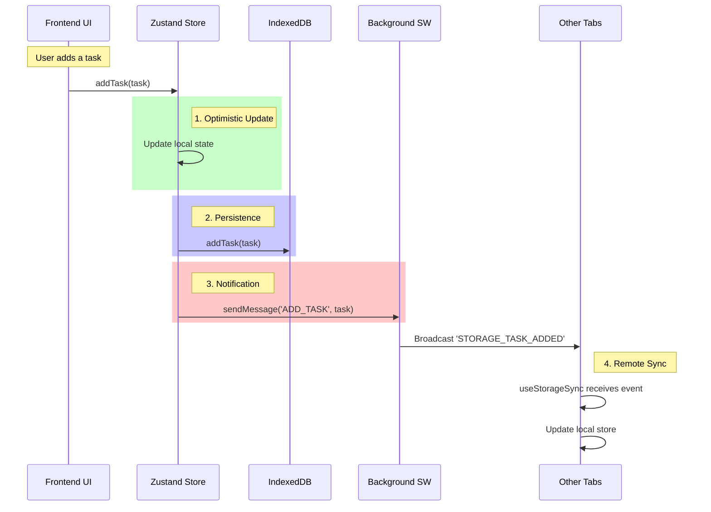

# Data Flow & Synchronization

## 🔄 Overview

TabPlex runs in two contexts: the **Frontend** (Popup, Side Panel, New Tab Page) and the **Background** (Service Worker). Keeping these in sync is critical.

We use a **Message-Based Synchronization** pattern. One source of truth (IndexedDB) is maintained by the active frontend, while the background orchestrates communication.

---

## 📡 Synchronization Mechanism

### The Sync Loop

### `useStorageSync` Hook

This hook is the heart of the frontend synchronization.

- **On Mount**: Loads all data from IndexedDB into the Zustand store.
- **On Event**: Listens for `chrome.runtime.onMessage` events (e.g., `STORAGE_TASK_UPDATED`) and updates the store _silently_ (without triggering a write back to DB, to avoid loops).

---

## 🛠️ Detailed Flows

### 1. Adding an Item (e.g., Tab)

1. **Component**: User clicks "Add Tab".
2. **TabSlice**:
    - Generates ID.
    - Updates `tabs` array in state.
    - Calls `addTabToDB(tab)`.
    - Sends `ADD_TAB` message to runtime.
3. **Background**:
    - `message-handler.ts` receives `ADD_TAB`.
    - Optionally performs background logic (e.g., if it needs to track open tabs).
    - Broadcasts change to other listeners.

### 2. Session Restore (Complex Flow)

1. **User**: Clicks "Restore" on a Session Card.
2. **SessionCard**: Calls `onRestore`.
3. **SessionsView**:
    - Iterates through `session.tabIds`.
    - Calls `chrome.tabs.create` for each URL.
    - Calls `addTab()` to register the new tab in TabPlex's store immediately.
    - **Note**: This ensures that even before the tab fully loads, TabPlex knows it belongs to the workspace.

---

## ⚠️ Race Conditions & Handling

- **Duplicate Events**: Unique IDs (`uuid` or timestamp-based) prevent duplicate creations. `useStorageSync` checks `if (!exists)` before adding.
- **Initial Load**: The app shows a loading state until `useStorageSync` confirms it has hydrated the store from IndexedDB.
- **Loops**: The "Silent" actions (`addTabSilently`, etc.) in the store are crucial. They update the UI state _without_ sending a message or writing to DB (assuming the event came from a DB write elsewhere).
